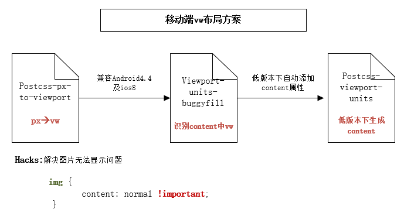

<!--
 * @Author: your name
 * @Date: 2020-03-06 16:37:30
 * @LastEditTime: 2020-03-11 14:11:49
 * @LastEditors: Please set LastEditors
 * @Description: In User Settings Edit
 * @FilePath: \vue-note\CSS\rem vs vw vs flexible.md
 -->
### 移动端适配
- 目前的解决方案
- flexible、rem、vw、px
- 传统适配方案适合于文本类APP，在大屏幕上可以看到更多内容
- rem与vw适合展示界面组件多样化，依赖于元素间的位置，大屏幕上相当于矢量图放大
- rem本质上使用vw方案，首先根据屏幕宽度定义htmlfont-size大小，根据字体大小定义各个元素宽度

#### rem

#### vw
- postcss-px-to-viewport
- viewport-units-buggyfill
- postcss-viewport-units
- css img hack

