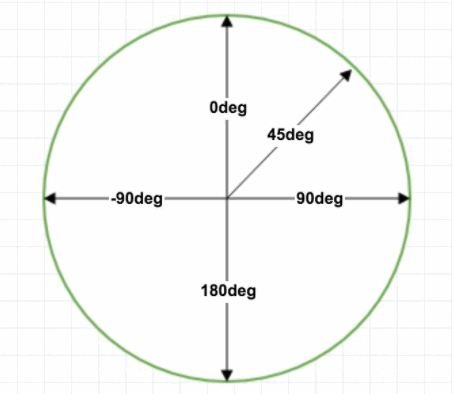

<!--
 * @Author: your name
 * @Date: 2020-03-04 14:47:11
 * @LastEditTime: 2022-05-12 15:50:40
 * @LastEditors: Juliette.Wang nannan.wang@broadlink.com.cn
 * @Description: In User Settings Edit
 * @FilePath: \vue-note\CSS\style.md
 -->

# 样式

## CSS 盒模型

CSS 盒模型由 content、padding、border、margin 组成，标准盒模型与怪异盒模型的区别是 width 的计算方式不同

- 
  width=content

  ```css
  box-sizing: content-box;
  ```

- 
  width=content+padding+border

  ```css
  box-sizing: border-box;
  ```

## BFC

块级格式上下文，独立的块级渲染区域，内部有一套渲染规格约束内容布局，且不受外面区域影响

- position 为 absolute 或 fixed
- float 为 left 或 right
- display 为 flex 或 inline-block
- overflow 为 hidden

应用场景

- 布局
- 清除浮动
- 解决边距 margin 重叠

## 4 种 box

- 行内框：行内元素的外框，鼠标选中文字的区域
- 行框：一行的虚拟矩形框
- 内容框：font+padding
- 容器框:包含行内元素及块元素的

## link 与@import 的区别

- link 支持动态引入，@import 不行
- link 标签可以添加其他属性，@import 只能引入 css
- 浏览器解析到 link 标签，会同步加载 css 文件，@import 是等到文档解析完成后加载
- @import 兼容性不如 link 标签

## 单位

width 的取值单位

- px
- %
- em : font-size 中是相对父元素字体的大小，其他属性中是相对本身字体的大小
- rem : root em
- vw & vh ：视图宽度或高度的 1/100
- vmin: vw 与 vh 中的最小值，vmax: vw 与 vh 中的最大值
- ch:数字 0 的宽度
- ex：x-height，一个小写 x 的高度,等于 em 的一半

## flex

```css
/* flex 属性 */
.container {
  display: flex;
  /* 设置主轴方向，交叉轴垂直于主轴 */
  flex-direction: row | row-reverse | column | column-reverse;
  /* 换行
  wrap-reverse:从下到上折行排列
   */
  flex-wrap: nowrap(default) | wrap | wrap-reverse;
  /* 主轴方向上的item对齐方式 
  space-between:起止item与父元素相邻，可用空间在item之间平均分配
  space-around:item两边的空间大小相等，item之间的空间是两个单位的间距，起止item与父元素间是一个单位间距
  space-evenly:item之间的间距以及item与父亲之间的间距相等
  */
  justify-content: stretch | flex-start | flex-end | center | space-between |
    space-around | space-evenly;
  /* 交叉轴上单行内item的对齐方式 */
  align-items: stretch | flex-start | flex-end | center | baseline;
  /* 交叉轴上多行之间的对齐方式 */
  align-content: stretch | flex-start | flex-end | center | space-between |
    space-around | space-evenly;
  gap: row-gap column-gap;
}
.childBox {
  /* 顺序为flex-grow | flex-shrink | flex-basis
    可用空间: 元素占据完以外的空间
    flex-grow: 可用空间的分配比例
    flex-shrink: 超出父元素的缩小比例
    flex-basis: 元素的空间大小
    flex:1; 相当于flex:1 1 0;
    */
  flex: 1 1 auto;
  order: 2;
  align-self: stretch | flex-start | flex-end | center | auto;
  padding: 32px;
}
```

## padding vs margin

padding 不能设置负值，margin 可以

## linear-gradient

渐变



```css
/* 
<type>: to [bottom=0,top=180,right=90,left=270],浏览器前缀规则不加 to
<color>, <color>: red, green, // 默认 red 到green，0-100%渐变
<color pos>: red 0%, green 100%, // red 到 green 渐变，50%为中间点
<color pos pos>: red 0% 10%, green 100%  // 0-10% 持续显示 red，10-100%渐变
<color pos>, <pos>, <color pos>: red 0%, 30%, green 100%  // 30%为渐变中间点
<color pos>,<color pos>,<color,pos>: red 0%, red 10%, green 10%, // 0-10% red 持续显示， red 与 green 之间有一条硬线，10-100% green持续显示，
 */
 {
  background-color: #f07575; /* 不支持渐变的浏览器回退方案 */
  background-image: -webkit-linear-gradient(
    top
  ); /* 支持 Chrome 25 and Safari 6, iOS 6.1, Android 4.3 */
  background-image: -moz-linear-gradient(top); /* 支持 Firefox (3.6 to 15) */
  background-image: -o-linear-gradient(top); /* 支持旧 Opera (11.1 to 12.0) */
  background-image: linear-gradient(to bottom); /* 标准语法; 需要最新版本 */
}
```

## border-image

[边框图片](https://segmentfault.com/a/1190000010969367)

<!--
url:  边框图片位置
slice:  图片裁减大小，number,percent(相对于边框图片)
width:  边框宽度，px
repeat: repeat:重复，round:平铺，stretch:拉伸(默认)
 -->

```css
border-image: url() <slice> / <width> / <repeat>;
```

## Grid

```css
.father {
  display: grid;
  grid-template-columns: 100px auto 100px; /* 显示网格 */
  grid-template-rows: repeat(auto-fill, minnum(50px, 1fr));
  grid-auto-columns: 100px; /* 隐式网格 */
  grid-auto-rows: 50px;
  grid-gap: 10px 20px; /* rows columns */
  grid-auto-flow: row dense;
  justify-content: center; /* father container */
  align-content: center;
  justify-items: center; /* child item */
  align-items: center;
}

.child {
  grid-column-start: 1;
  grid-column-end: 2;
  grid-row-start: 1;
  grid-row-end: 2;
}
```

## style in react

[教程](https://css-tricks.com/a-complete-guide-to-calc-in-css/)

```js
const statusHeight = 20;
const fixedStyle = {
  top: `calc(1.2rem + ${statusHeight}px)`,
};
```

## 单冒号与双冒号的区别

单冒号‘:’用来表示伪类，表示标签的特殊状态或者某一行

```css
a:hover {
}
p:first-child {
}
```

双冒号‘::’，表示伪元素，像是添加了新的 Html 元素

```css
div::before {
}
div::after {
}
```

CSS3 中向上兼容，同时也支持单冒号的伪元素

## 选择器

- !important
- id 选择器(#)
- 类选择器(.)
- 属性选择器(input[type='text'])
- 子代选择器(ul>li,只选择儿子)
- 后代选择器(div p,选择所有后代)
- 兄弟选择器(div+p)
- 标签选择器(div)
- 伪类选择器(a:hover)
- 伪元素选择器(div::before)
- 通配选择器(\*)

!important > 元素行内内联样式 > id 选择器 > 类选择器=伪类选择器=属性选择器 > 标签选择器=伪元素选择器 > 通配选择器=后代选择器=兄弟选择器

## 可继承属性

字体相关

- font
- font-size
- font-family
- font-weight

文本相关

- text-indent
- white-space(元素空白，是否换行)
- word-spacing(单词间距)
- letter-spacing(字母间距)

可见性

- visibility

## visibility

```css
/* 
visible: 元素正常可见
hidden: 元素隐藏，仍在文档流中其他元素位置不变，只是元素透明，给子元素设置visibility：visible，子元素可见，重绘
collapse: 普通元素效果如hidden，table标签效果如display: none(不存在文档流中，回流)
 */
div {
  visibility: visible | hidden | collapse;
}
```

## opacity vs rgba

- opacity 作用的元素及元素内的所有内容都会透明，可继承
- rgba 作用于元素颜色或背景色，不可继承

##  取值

line-height=font-size+行距,指文本基线之间的距离,文本没有 height 属性时，line-height 撑开行距

line-height 取值：normal|length|number|em|%|inherit

| element | font-size | line-height | 计算    |
| ------- | --------- | ----------- | ------- |
| body    | 16        | normal      | 16\*1.2 |
| h1      | 32        |             | 32\*1.2 |

| element | font-size | line-height | 计算 |
| ------- | --------- | ----------- | ---- |
| body    | 16        | 16px        | 16px |
| h1      | 32        |             | 16px |

| element | font-size | line-height | 计算    |
| ------- | --------- | ----------- | ------- |
| body    | 16        | 1.5         | 16\*1.5 |
| h1      | 32        |             | 32\*1.5 |

| element | font-size | line-height | 计算    |
| ------- | --------- | ----------- | ------- |
| body    | 16        | 1.5em       | 16\*1.5 |
| h1      | 32        |             | 32\*1.5 |

| element | font-size | line-height | 计算     |
| ------- | --------- | ----------- | -------- |
| body    | 16        | 150%        | 16\*150% |
| h1      | 32        |             | 16\*150% |

| element | font-size | line-height | 计算    |
| ------- | --------- | ----------- | ------- |
| body    | 16        | normal      | 16\*1.2 |
| h1      | 32        | inherit     | 32\*1.2 |

父元素 line-height 设置百分比，子元素不设置时，子元素行高为父元素的行高计算值。一般建议行高设置为 number

## position 属性

> static: 默认值；
> relative: 相对于元素正常文档流位置定位，会预留空间；
> absolute: 相对于最近非 static 祖先元素定位，脱离文档流；
> fixed: 相对于浏览器窗口定位，脱离文档流；

备注：谷歌/火狐浏览器下，父元素添加 transform 属性值不为 none，position:fixed 属性是相对于父元素

## 设置元素浮动

元素设置浮动后，display 为 block

## 清除浮动的方法

```css
/* 父元素设置高度 */
.fatherBox {
  height: 100px;
}
/* 父元素设置zoom */
.fatherBox:after {
  z-index: 1;
}
/* 父元素设置overflow */
.fatherBox {
  overflow: hidden | auto;
}
/* 浮动元素后面的元素设置清除 */
.footer {
  clear: both;
}
```

## Box 上下布局

上面 box 固定为 100px,下面占满剩下屏幕

```css
.top {
  height: 100px;
}

/* 方案一 */
.bottom {
  height: calc(100%-100px);
}
```

```css
/* 方案二 */
.container {
  position:relative;
}
.bottom {
  position：absolute;
  top:100px;
  bottom:0;
}
```

```css
/* 方案三 */
.container {
  display: flex;
  flex-direction: column;
}
.bottom {
  flex: 1;
}
```

## div 水平垂直居中

```css
/* 方案一 absolute + 负margin */
.father {
  position: relative;
}
.center {
  width: 100px;
  height: 100px;

  position: absolute;
  left: 50%;
  right: 50%;
  margin-left: -50px;
  margin-right: -50px;
}

/* 方案二 absolute + margin auto*/
.father {
  position: relative;
}
/* 不设置宽高度，会铺满父元素 */
.center {
  width: 100px;
  height: 100px;

  position: absolute;
  top: 0;
  bottom: 0;
  left: 0;
  right: 0;
  margin: auto;
}

/* 方案三 absolute+transform */
.father {
  position: relative;
}
.center {
  position: absolute;
  top: 50%;
  left: 50%;
  transform: translate(-50%, -50%);
}

/* 方案四 flex */
.father {
  display: flex;
  justify-content: center;
  align-items: center;
}
.center {
  width: 100px;
  height: 100px;
}
```

## div 内容居中

```css
.center {
  /* 行元素 */
  text-align: center;
  height: 元素高度;
  line-height: 元素高度;
}
```

## a 标签的伪类状态顺序

LVHA

```css
a:link {
}
a:visited {
}
a:hover {
}
a:active {
}
```

## ellipsis

文字不换行，超出部分显示省略号,

```css
/* 只对block元素有效 */
.ellipsis{
  overflow：hidden；
  text-overflow：ellipsis；
  white-space：no-wrap;
}

/* flex元素添加省略效果，需要添加以下 */

.flex-box{
  display:flex;
}

.flex-item{
  flex:1;
  min-width:0;
}


/* 多行文字 */
.ellipsis {
  width: 200px;
  display: -webkit-box;
  -webkit-box-orient: vertical;
  -webkit-line-clamp: 3;
  overflow: hidden;
}
```

## hacks

```css
/* 不同浏览器的样式不同 */
* {
  margin: 0;
  padding: 0;
}
/* 谷歌浏览器不能显示12px以下字体 */
body {
  -webkit-text-adjust: none;
  font-size: 12px;
  -webkit-transform: scale(0.8);
}

/* 超链接点击完之后，样式不再显示，定义样式顺序 LVHA*/
a:link {
}
a:visited {
}
a:hover {
}
a:active {
}

/* ios input标签不能输入 */
input {
  -webkit-user-select: auto;
}

/* ios下字体变清晰变细 */
p {
  -webkit-font-smoothing: antialiased;
}
```

## 重绘和回流

> 重绘
>
> > DOM 的修改导致元素的样式变化，如 color
> > 界面不用重新经过生成布局树，构建图层树的过程，开销小

> 回流
>
> > DOM 的修改元素的几何属性变化，width|height|padding，或者 DOM 节点的增加和删除
> > 使界面重新经过样式计算，生成布局树，构建图层树，再重新绘制界面，开销很大

> 避免回流
>
> > 减少频繁使用 style，改为使用 class
> > 对 DOM 的操作，合并使用批量操作
> > 减少频繁读取引起回流的属性，使用缓存
> > 使用 visibility:none 代替 display:none,前者是重绘，后者是回流
> > 不使用 table 布局

## 提升 CSS 性能的方法

- 文件合并，减少 http 请求
- 使用 link 方式引入，把代码放在 head 里面
- 减少使用表达式
- css 文件压缩
- 使用雪碧图
- 属性值 0 时，省略单位，属性值小数时，省略 0
- 使用合理的选择器
