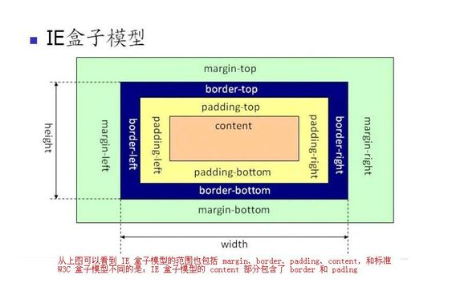

<!--
 * @Author: your name
 * @Date: 2020-03-04 14:47:11
 * @LastEditTime: 2021-06-10 17:20:49
 * @LastEditors: Please set LastEditors
 * @Description: In User Settings Edit
 * @FilePath: \vue-note\CSS\style.md
 -->

# 样式

## 优先级

## position

sticky

## ellipsis

文字不换行，超出部分显示省略号

```css
.text-ellipsis{
  display：inline-block；
  overflow：hidden；
  text-overflow：ellipsis；
  white-space：no-wrap;
}
```

## flex

文字居中显示

```css
.father-box {
  display: flex;
  align-items: center;
}

.text {
  position: absolute;
  left: 50%;
  top: 50%;
  transform: translate(-50%, -50%);
}
```

## padding vs margin

padding 不能设置负值，margin 可以

## linear-gradient

渐变

```css
/* 
<type>: to [bottom=0,top=180,right=90,left=270],浏览器前缀规则不加 to
<color>, <color>: red, green, // 默认 red 到green，0-100%渐变
<color pos>: red 0%, green 100%, // red 到 green 渐变，50%为中间点
<color pos pos>: red 0% 10%, green 100%  // 0-10% 持续显示 red，10-100%渐变
<color pos>, <pos>, <color pos>: red 0%, 30%, green 100%  // 30%为渐变中间点
<color pos>,<color pos>,<color,pos>: red 0%, red 10%, green 10%, // red 与 green 之间有一条硬线，red 到 green， 10-100%渐变，
 */
 {
  background-color: #f07575; /* 不支持渐变的浏览器回退方案 */
  background-image: -webkit-linear-gradient(
    top
  ); /* 支持 Chrome 25 and Safari 6, iOS 6.1, Android 4.3 */
  background-image: -moz-linear-gradient(top); /* 支持 Firefox (3.6 to 15) */
  background-image: -o-linear-gradient(top); /* 支持旧 Opera (11.1 to 12.0) */
  background-image: linear-gradient(to bottom); /* 标准语法; 需要最新版本 */
}
```

## border-image

[边框图片](https://segmentfault.com/a/1190000010969367)

<!--
url:  边框图片位置
slice:  图片裁减大小，number,percent(相对于边框图片)
width:  边框宽度，px
repeat: repeat:重复，round:平铺，stretch:拉伸(默认)
 -->

```css
border-image: url() <slice> / <width> / <repeat>;
```

## Grid

```css
.father {
  display: grid;
  grid-template-columns: 100px auto 100px; /* 显示网格 */
  grid-template-rows: repeat(auto-fill, minmax(50px, 1fr));
  grid-auto-columns: 100px; /* 隐式网格 */
  grid-auto-rows: 50px;
  grid-gap: 10px 20px; /* rows columns */
  grid-auto-flow: row dense;
  justify-content: center; /* father container */
  align-content: center;
  justify-items: center; /* child item */
  align-items: center;
}

.child {
  grid-column-start: 1;
  grid-column-end: 2;
  grid-row-start: 1;
  grid-row-end: 2;
}
```

## style in react

[教程](https://css-tricks.com/a-complete-guide-to-calc-in-css/)

```js
const statusHeight = 20;
const fixedStyle = {
  top: `calc(1.2rem + ${statusHeight}px)`,
};
```

## CSS 盒模型

CSS 盒模型由 content、padding、border、margin 组成，标准盒模型与怪异盒模型的区别是 width 的计算方式不同

- 
  width=content

  ```css
  box-sizing: content-box;
  ```

- 
  width=content+padding+border

  ```css
  box-sizing: border-box;
  ```

## BFC

块级格式上下文，独立的块级渲染区域，内部有一套渲染规格约束内容布局，且不受外面区域影响

- position 为 absolute 或 fixed
- float 为 left 或 right
- display 为 flex 或 inline-block
- overflow 为 hidden

应用场景

- 布局
- 清除浮动
- 解决边距 margin 重叠

## 单冒号与双冒号的区别

单冒号‘,’用来表示伪类，表示标签的特殊状态或者某一行

```css
a:hover {
}
p:first-child {
}
```

双冒号‘:’，像是添加了新的 Html 元素

```css
div::before {
}
div::after {
}
```

CSS3 中向上兼容，同时也支持单冒号的伪元素

## opacity vs rgba

- opacity 作用的元素及元素内的所有内容都会透明，可继承
- rgba 作用于元素颜色或背景色，不可继承

## 提升 CSS 性能的方法

- 文件合并，减少 http 请求
- 使用 link 方式引入，把代码放在 head 里面
- 减少使用表达式
- css 文件压缩
- 使用雪碧图
- 属性值 0 时，省略单位，属性值小数时，省略 0
- 使用合理的选择器

##  取值

line-height=font-size+行距,指文本基线之间的距离,文本没有 height 属性时，line-height 撑开行距

line-height 取值：normal|length|number|em|%|inherit

| element | font-size | line-height | 计算    |
| ------- | --------- | ----------- | ------- |
| body    | 16        | normal      | 16\*1.2 |
| h1      | 32        |             | 32\*1.2 |

| element | font-size | line-height | 计算 |
| ------- | --------- | ----------- | ---- |
| body    | 16        | 16px        | 16px |
| h1      | 32        |             | 16px |

| element | font-size | line-height | 计算    |
| ------- | --------- | ----------- | ------- |
| body    | 16        | 1.5         | 16\*1.5 |
| h1      | 32        |             | 32\*1.5 |

| element | font-size | line-height | 计算    |
| ------- | --------- | ----------- | ------- |
| body    | 16        | 1.5em       | 16\*1.5 |
| h1      | 32        |             | 32\*1.5 |

| element | font-size | line-height | 计算     |
| ------- | --------- | ----------- | -------- |
| body    | 16        | 150%        | 16\*150% |
| h1      | 32        |             | 16\*150% |

| element | font-size | line-height | 计算    |
| ------- | --------- | ----------- | ------- |
| body    | 16        | normal      | 16\*1.2 |
| h1      | 32        | inherit     | 32\*1.2 |

父元素 line-height 设备百分比，子元素不设置时，子元素行高为父元素的行高计算值。一般建议行高设置为 number

## 4 种 box

- 行内框：行内元素的外框，鼠标选中文字的区域
- 行框：一行的虚拟矩形框
- 内容框：font+padding
- 容器框:包含行内元素及块元素的

## Box 上下布局

上面 box 固定为 100px,下面占满剩下屏幕

```css
/* 方案一 */
.bottom {
  height: calc(100%-100px);
}
```

```css
/* 方案二 */
.container {
  position:relative;
}
.bottom {
  position：absolute;
  top:100px;
  bottom:0;
}
```

```css
/* 方案三 */
.container {
  display: flex;
  flex-direction: column;
}
.bottom {
  flex: 1;
}
```
