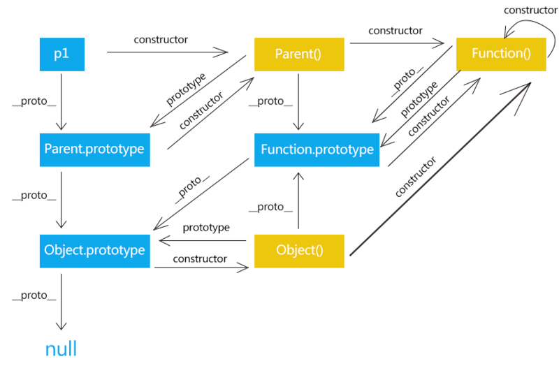

<!--
 * @Author: your name
 * @Date: 2021-06-11 10:52:55
 * @LastEditTime: 2021-06-11 15:53:05
 * @LastEditors: Please set LastEditors
 * @Description: In User Settings Edit
 * @FilePath: \vue-note\ES6\base.md
-->

# 基础点

数据类型、运算、对象、Function、继承、闭包、作用域、原型链、事件、RegExp、JSON、Ajax、DOM、BOM、内存泄漏、跨域、异步装载、模板引擎、前端 MVC、路由、模块化、Canvas、ECMAScript

## 

函数 vs 构造函数

普通函数被用作通过 new 构造实例才叫构造函数

```js
const Parent=functon(){};
const p=new Parent();
```

每个对象都存在 _proto_ 和 constructor 属性，_proto_ 指向对象原型；
函数是特殊对象，还具有 prototype 属性，当函数对象作为构造函数创建实例时，prototype 会被赋值给 _proto_

instance._proto_=instance.constructor.prototype

当访问对象的属性不存在时，会根据 _proto_ 查找 对象原型 prototype 是否存在，如果还不存在会继续查找 prototype 的 prototype 是否存在，直到找到或为 undefined，就是所说的原型链

## 导致内容泄露

- 使用闭包
- 两个对象互相引用
- 没有使用 var 定义全局变量
- setTimeout 方法的第一个参数是字符串,而不是参数

垃圾回收机制：垃圾回收器会定期扫描对象，并计算被引用的其他对象个数，当被引用次数为 0，会回收该对象内存

## 如何编写高性能 JS

- 使用严格编码格式，‘use strict’
- js 在文档最后加载，使用异步加载
- 代码压缩，减少 HTTP 请求
- 变量声明，setTimeout 参数为函数，少用闭包
- 减少重绘和重排(回流)
