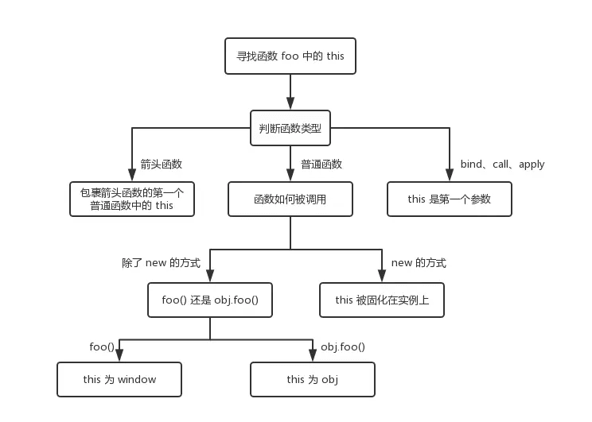

<!--
 * @Author: your name
 * @Date: 2021-06-11 10:52:55
 * @LastEditTime: 2021-08-19 15:14:14
 * @LastEditors: Please set LastEditors
 * @Description: In User Settings Edit
 * @FilePath: \vue-note\ES6\base.md
-->

# 基础点

数据类型、运算、对象、Function、继承、闭包、this、作用域、原型链、事件、RegExp、JSON、Ajax、DOM、BOM、内存泄漏、跨域、异步装载、模板引擎、前端 MVC、路由、模块化、Canvas、ECMAScript

## 继承

## class

## 构造函数

## 

函数 vs 构造函数

普通函数被用作通过 new 构造实例才叫构造函数

```js
const Parent=functon(){};
const p=new Parent();
```

每个对象都存在 _proto_ 和 constructor 属性，_proto_ 指向对象原型；
函数是特殊对象，还具有 prototype 属性，当函数对象作为构造函数创建实例时，prototype 会被赋值给 _proto_

实例._proto=原型
原型.constructor=构造函数
构造函数.prototype=原型
instance.\_proto_=instance.constructor.prototype

当访问对象的属性不存在时，会根据 _proto_ 查找 对象原型 prototype 是否存在，如果还不存在会继续查找 prototype 的 prototype 是否存在，直到找到属性或找到 Object 为止，形成一个原型指向的链条，就是所说的原型链

## 导致内存泄露

- 使用闭包
- 两个对象互相引用
- 没有使用 var 定义全局变量
- setTimeout 方法的第一个参数是字符串,而不是函数

垃圾回收机制：垃圾回收器会定期扫描对象，并计算被引用的其他对象个数，当被引用次数为 0，会回收该对象内存

## 

- new 创建对象时,绑定到新创建的对象

```js
function fun() {
  console.log(this);
}
var fun1 = new fun();
```

- 对象调用时,绑定到调用的对象

```js
function fun() {
  console.log(this);
}
var obj.fun=fun;
obj.fun();
```

- bind,call,apply,严格模式下,绑定到第一个参数;非严格模式下,null 或 undefined 指向全局对象

```js
const obj = {};
function fun() {
  console.log(this);
}
var funObj = fun.bind(obj);
funObj();
```

- 普通函数调用,严格模式指向 undefined,非严格模式指向 window

```js
function fun() {
  console.log(this);
}
fun();
```

- 箭头函数本身没有 this,继承自外层最近的父函数 this,前面几种都是动态绑定，箭头函数是静态的即声明时绑定

```js
const obj = {
  name: 'test',
  fun() {
    return () => {
      console.log(this);
    };
  },
};
```

## 判断数据类型

> typeof
>
> > 能准确判断基本数据类型，null 会显示 object
> > function 能正确显示，其他对象都显示 object

> instanceof
>
> > 对象能正确显示
> > 基本类型不能显示

> Object.prototype.toString.call
>
> > 基本类型和对象都能正确显示

## addEventListener 的第三个参数

true:表示捕获 false:表示冒泡，针对的是 safari 浏览器，禁止/开启滚动时会用到

## DOM 事件流

事件在 dom 节点之间会按特定的顺序传播，这个传播的过程叫做 DOM 事件流

捕获阶段：从 window 发出，自上而下
目标阶段：真正的目标阶段是处理事件的阶段
冒泡阶段：自下而上，冒泡到 window

## var vs let vs const

相同点：作用都是声明变量
不同点：

- var 存在变量提升,可以在声明之前调用,let、const 不可以
- var 全局作用域下声明的变量挂载在 window 下,let、const 不会
- let、const 声明的变量存在作用域,const 声明变量后不能重新赋值

引申：提升指把声明的函数及变量提升到作用域顶部,函数会提升整个函数,变量只会提升声明,相同变量名时函数会覆盖变量

## for in vs for of

for...in 是 es5 语法，for...of 是 es6 语法，修复了遍历出原型链上属性的问题

> for... in 循环遍历 keys
>
> for...in 遍历可枚举的属性，包括原型链上的属性
>
> 去除原型链上的属性，使用 hasOwnProperty

> for...of 循环遍历 values
>
> for...of 遍历可迭代的属性
>
> for...of 不能用于遍历对象

## Object.is() vs == ===

== 弱相等，对比时存在数据类型转换，===强相等 不会数据类型转换

Object.is 优化了强相等的两个问题：

```js
+0 === -0; // true
NaN === NaN; // false

Object.is(+0, -0); // false
Object.is(NaN, NaN); // true
```

## 类型转换

- 如果一方是字符串，会把另一方转换成字符串
- 如果一方不是字符串或数字，会转换成数字或字符串

```js
'1' + true; // 规则1：‘1true’
true + true; // 规则2：2
4 + [1, 2, 3]; // 先触发规则2：4+‘1，2，3’，再触发规则1：‘41，2，3’
```

> 备注：
>
> > 数组转 Number 类型：</br>
> > 空数组：0</br>
> > 一个元素：元素转 Number</br>
> > 其他情况：NaN

- 除了加法运算符，只要一方是数字，另一方会被转换成数字

```js
2 * '3'; // '3'=>3,结果是6
2 * []; // 2*0,结果是0
2*['1']; // 2*1,结果是2
2 * [1，2，3]; // 2*NaN,结果是NaN
```

## ES6 新语法

- let、const 声明变量
- 扩展运算符
- 解构赋值
- 箭头函数
- 字符串模板
- for...of

## Symbol 的作用

可以用来表示独一无二的变量，防止命名冲突

## 如何编写高性能 JS

- 使用严格编码格式，‘use strict’
- js 在文档最后加载，使用异步加载
- 代码压缩，减少 HTTP 请求
- 变量声明，setTimeout 参数为函数，少用闭包
- 减少重绘和重排(回流)
