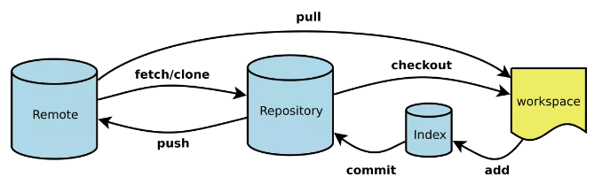
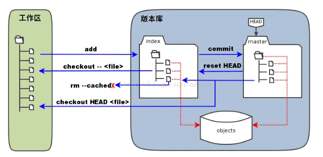

<!--
 * @Author: your name
 * @Date: 2020-03-24 15:11:35
 * @LastEditTime: 2020-09-01 17:35:39
 * @LastEditors: Please set LastEditors
 * @Description: In User Settings Edit
 * @FilePath: \vue-note\Tools\Git.md
 -->

# Git

## SVN vs Git

SVN 是集中式版本管理，项目的开发人员需要远程中央服务器来共享文件。Git 是分布式版本管理，每个人只用本地分支上开发，最后 push 到远程服务器与其他人员文件保持一致。

git 中工作区(workplace)、暂存区(stage)、本地仓库(repository)、远程(remote)之间的关系

- 

工作区与暂存区与本地仓库间的操作

- 

## 基本命令

- 设置全局参数，git config --global user.name 'Nancy2013'
- 设置全局参数，git config --globabl user.email 'wangnannangg@gmail.com'
- 初始化，git init
- 添加所有文件，git add .
- 提交到暂存区，git commit -m '备注'
- 从远程拉取，git fetch
- 合并到本地，git merge `<remote-name>/<baranch-name>`
- 切换本地分支，git checkout `<baranch-name>`
- 查看本地分支，git branch
- 推送到远程，git push
- 移除远程仓库，git remote rm `[remote-name]`
- 查看项目文件状态，git status
- 查看操作日志，git log
- 本地生成 SSH 密钥，ssh-keygen -t rsa –C “wangnannangg@gmail.com”
- 首次拉取远程仓库，git remote add origin https://github.com/Nancy2013/test.git
- 克隆远程仓库，git clone https://github.com/Nancy2013/test.git

## .git

创建 git 项目后，在文件夹内都会生成一个.git 文件进行本地的版本管理

## .gitignore

可以通过.gitignore 配置忽略上传文件

- 忽略所有已.js 结尾的文件，\*.js
- 忽略.js 结尾，但是 a.js 除外，!a.js
- 忽略根目录下的 build 文件，/build
- 忽略 node_module 下的所有文件，node_module/

## [git CI/CD](https://docs.gitlab.com/ce/ci/yaml/README.html#stages)

### What

支持持续集成与持续交付的在线工具

### Why

可以构建并测试代码，编译完成后支持自动部署，能够提高效率，减少 bug 保证代码质量。

### How

配置.gitlab-ci.yml 文件,并在 GitLab Runner 服务器中运行

- stages 场景阶段
  - build
  - test
  - deploy
- job 任务

  ```javascript
  job_name:
    script:
      - npm install, // 执行的脚本,必须，其他参数均是非必须
    stage:
      - build // 场景阶段,默认为test
    only:
      - master, // 执行的分支,master分支push时触发
    except:
      - dev, // 不执行分支
    tags:'V1.0', // 执行标签,打tags的分支push时触发
    allow_failure: true // 是否容错，上面任务失败，下面任务不执行
    artifacts: // 缓存文件，提供给后面的任务使用
      paths:
        - bin/
  ```

相同 stage 名任务，并行执行；不同 stage 名顺序依次执行，前面任务失败后停止执行

### artifacts VS cache

- 使用场景：artifacts 存储前面任务的结果；cache 缓存依赖的安装包；
- 有效期限：artifacts 可以设置有效时间；cache 无，不能自动清理；
- 是否存在：artifacts 任务每次执行时会在服务器上下载，一定存在并保证最新；cache 不一定存在，后面任务可能编译失败，不能保证是最新文件；
- 特殊设置：dependencies 属性，可以在任务中禁用不需要的 artifacts，提高构建速度；也可以用来确定 cache 任务一定存在；
