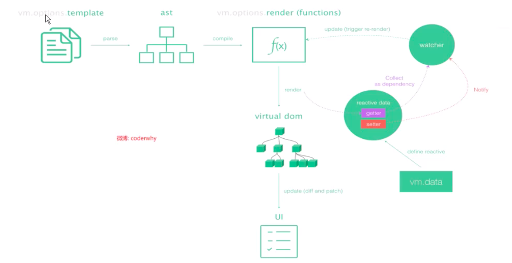

<!--
 * @Author: your name
 * @Date: 2020-02-27 09:19:45
 * @LastEditTime: 2020-02-27 11:27:52
 * @LastEditors: Please set LastEditors
 * @Description: In User Settings Edit
 * @FilePath: \vue-note\Vue.md
 -->

## Vue

### 版本介绍

- runtime-only 与 runtime-compile 版本的区别

  - runtime-only 是运行时版本，compiler 有编译功能；
  - runtime-only 版本中 vue 实例：

  ```javascript
  new Vue({
  	el: '#app',
  	components: {
  		App,
  	},
  	template: '<App/>',
  });
  ```

  runtime-compiler 版本中的 vue 实例：

  ```javascript
  new Vue({
  	el: '#app',
  	render: h => h(App),
  });
  ```

  可以发现 runtime-only 中只支持 render 函数，而 compiler 支持 template 标签；

  - 在 webpack 中默认引用的为 runtime-only ,使用 vue-loader 可以把.vue 文件编译为 JavaScript 文件，同时需要 vue-template-compiler 将.vue中的 template 标签 编译为 render 函数。也可以通过在 webpack 中配置 vue\$加载 vue.esm.js 完整版本

### Vue 渲染过程

template --> ast(抽象语法树) --> render --> VDom --> 真实 Dom --> 页面

### Vue 实例

- el 与 template 属性的区别
  - el 与 template 都可以将 Vue 实例挂载到 Dom;
  - 使用 template 会把 el 挂载的 id 树结构直接替换掉；
