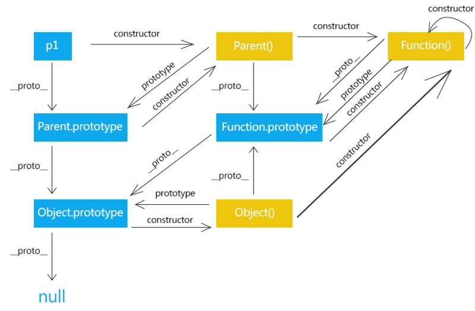

<!--
 * @Author: your name
 * @Date: 2020-02-27 09:19:45
 * @LastEditTime: 2021-06-30 17:40:13
 * @LastEditors: Please set LastEditors
 * @Description: In User Settings Edit
 * @FilePath: \vue-note\Vue.md
 -->

## Vue

### vue 全家桶

> vue
> vue-router
> vuex
> and design vue | element UI |vant
> axiso

### 版本介绍

- runtime-only 与 runtime-compile 版本的区别

  - runtime-only 是运行时版本，compiler 有编译功能；
  - runtime-compiler 版本中的 vue 实例：

  ```javascript
  new Vue({
    el: '#app',
    components: {
      App,
    },
    template: '<App/>',
  });
  ```

runtime-only 版本中 vue 实例：

```javascript
new Vue({
  el: '#app',
  render: (h) => h(App),
});
```

可以发现 runtime-only 中只支持 render 函数，而 compiler 支持 template 标签；

- 在 webpack 中默认引用的为 runtime-only ,使用 vue-loader 可以把.vue 文件编译为 JavaScript 文件，同时需要 vue-template-compiler 将.vue 中的 template 标签 编译为 render 函数。也可以通过在 webpack 中配置 vue\$加载 vue.esm.js 完整版本

### Vue 渲染过程

template --> ast(抽象语法树) --> render --> VDom --> 真实 Dom --> 页面


### 响应式原理


- 将对象作为 Vue 实例的 data 对象的 property
- Object.defineProperty 遍历 data 属性，生成对应的 getter/setter 方法
- 每个组件实例对应一个 watcher,渲染时会生成每个 property 的记录依赖
- 当 property 进行 getter/setter 操作时，会进行通知变更，通知组件重新渲染

### 编译原理

将 template 编译成 render 函数的过程

> parse:编译模板
>
> > 首先通过正则表达式，将 html 编译成 AST 抽象语法树
>
> optimize:优化抽象树
>
> > vue 是响应式，其中一些节点渲染后不会再变化，可以将静态节点标记出来，虚拟 DOM diff 过程可以直接跳过
>
> generate:生成代码
>
> > 把 AST 抽象语法树编译成函数

### 生命周期

- beforeCreate
- Created，进行数据请求
- beforeMount
- Mounted，进行 DOM 操作
- beforeUpdate
- Updated
- beforeDestroy
- Destroyed，不能访问 this

### Vue 实例

- el 与 template 属性的区别
  - el 与 template 都可以将 Vue 实例挂载到 Dom;
  - 使用 template 会把 el 挂载的 id 树结构直接替换掉；

### Vue 原型链

[](https://segmentfault.com/a/1190000021232132)

### Vue 中使用了哪些模式

- 工厂模式 通过参数创建实例
- 单例模式 整个程序只有一个实例
- 发布/订阅模式 响应式数据原理
- 观察者模式
- 装饰模式
- 策略模式

### Vue 性能优化

- data 层级不要太深
- 区别使用 v-if 和 v-show
- 区别使用 computed 和 watch
- v-for 与 v-if 不同时使用
- 使用 v-for 时，添加 key
- 使用 keep-alive 缓存
- 图片懒加载、路由懒加载
- 第三方插件按需引入

Webpack 层面：

- 代码分块，公共代码提取(CommonsChunkPlugin)
- js、css 文件提取
- 构建结果输出分析，可视化分析工具(webpack-bundle-analyzer)

## $set 解决的问题及原理

JavaScript 对象赋值给 data 后，初始化实例时，Object.defineProperty 会遍历属性，并转换为 get/set 方法。对于 data 中不存在的属性，没有这个过程因此无法检测到。
$set 是通过手动方式，将属性转换为响应式数据。

### nextTick 应用及原理

nextTick 回调函数推迟到下次 DOM 更新完成后执行，在回调函数中可以得到更新后的数据。
原理为：使用异步执行回调函数

### key 值的作用

key 作为节点的唯一 id,主要使用在 vue 虚拟 DOM 新旧节点 diff 中,用来查找节点。使用 key,使 diff 操作更准确和迅速。不使用 key,vue 会使用最大限度减少动态元素，就地修改或复用相同类型组件的算法。
