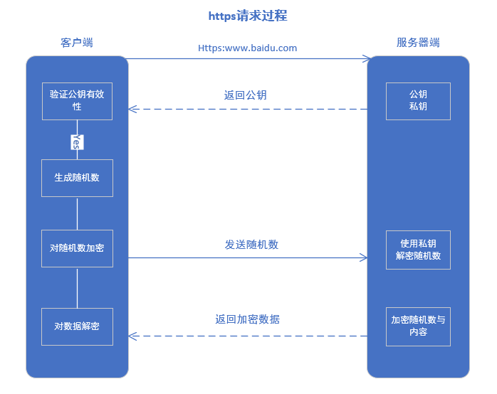

<!--
 * @Author: your name
 * @Date: 2020-03-04 14:57:32
 * @LastEditTime: 2020-03-11 17:49:36
 * @LastEditors: Please set LastEditors
 * @Description: In User Settings Edit
 * @FilePath: \vue-note\网络\http.md
 -->
## 网络

### http vs https

| 区别     | http                | https                                     |
|----------|---------------------|-------------------------------------------|
| 协议     | http 超文本传输 | http + SSL 超文本传输、加密套接字协议 |
| 安全性   | 不安全              | 安全                                      |
| 端口     | 80                  | 443                                       |
| 传输内容 | 明文                | 加密数据                                  |
| 收费     | 否                  | CA证书收费                                |
| 请求速度 | 快                  | 慢                                        |
### https请求过程
