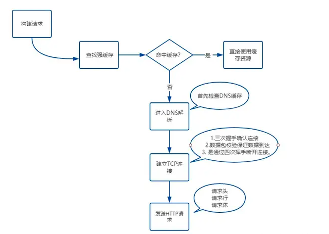
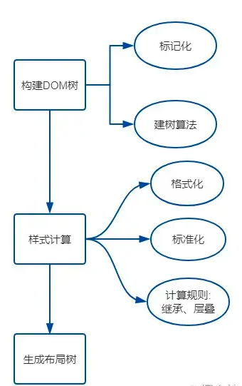
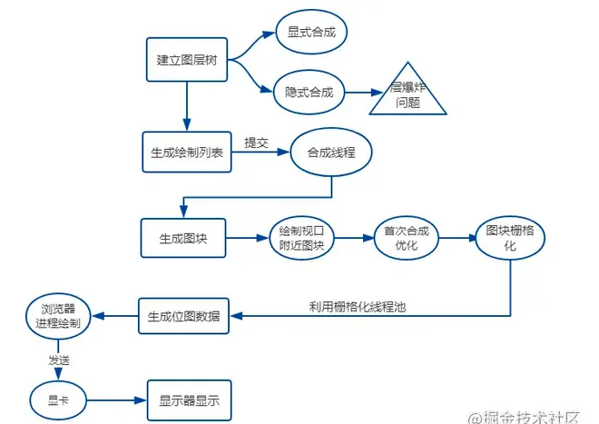

<!--
 * @Author: your name
 * @Date: 2020-03-02 09:59:12
 * @LastEditTime: 2020-03-04 15:37:44
 * @LastEditors: Please set LastEditors
 * @Description: In User Settings Edit
 * @FilePath: \vue-note\Conception\缓存.md
 -->

# 缓存

## 缓存类型

### 强缓存

不需要发生 http 请求

- 标志位

http1.0: Expires:Expires: Wed, 22 Nov 2019 08:41:00 GMT 时间点， 当浏览器与服务器时间不一致时，会出现误差
http1.1: Cache-Control: max-age=3600,表示响应一个小时之内都可以使用缓存，与 Expires 同时存在时，优先考虑 Cache-Control

### 协商缓存

强缓存失效后发送 http 请求，在请求头添加 tag，服务器根据 tag 来决定是否使用缓存，就是协商缓存

- 标志位
  - Last-modified: 浏览器发送请求后，服务器响应会返回该属性，浏览器再次请求会带上 If-Modified-Since，这个字段的值是服务器返回的资源修改时间，服务器拿到这个值后跟本地资源的最后修改时间做对比
  - Etag: 服务器根据文件生产的唯一表示，文件发生变化后这个值就会变化，浏览器再次请求会带上 if-None-Match，服务器收到之后会跟资源的 Etag 做对比
    资源更新了就返回新资源，返回码为 200，没有更新就返回 304，浏览器直接使用缓存
- 两者对比
  - Etag 精确度高于 Last-modified，主要在两个方面，一编辑了资源但文件内容没有变会导致缓存失效，二 Last-modified 的感知精确度是 1s,即 1s 之能多次修改文件不会体现出修改
  - Last-modified 的性能高于 Etag,因为 Last-modified 存的是时间，而 Etag 需要根据文件内容生成 hash 值

## 存储位置

- Service Worker
- Memory Cache
- Disk Cache
- Push Cache

总结

首先通过 Cashe-control 判断强缓存是否可用，失效后使用协商缓存
协商缓存要通过 http 请求，服务器响应头部返回 Last-Modified 或者 Etag 字段，浏览器再次请求时头部加上 If-Modified-Since 或者 If-None-Match，服务器进行对比

- 缓存失效，返回新的文件资源
- 缓存没有失效，返回 304 告诉浏览器使用缓存资源

## 浏览器的本地存储

分为 Cookie,WebStorage(sessionStorage & localStorage),IndexDB

| 属性      | sessionStorage                                           | localStorage                             | Cookie                                                                                           |
| --------- | -------------------------------------------------------- | ---------------------------------------- | ------------------------------------------------------------------------------------------------ |
| 生命周期  | 会话缓存，关闭浏览器失效                                 | 本地缓存，永久有效除非手动清除           | 可设置有效时长，分为服务器端及浏览器端 服务器端：根据设定的时间 浏览器端：关闭浏览器失效 |
| 大小      | 5M                                                       | 5M                                       | 4KB                                                                                              |
| http 请求 | 本地存储不与服务端交互                                   | 本地存储不与服务端交互                   | 每次 http 请求都会携带，cookie 比较多时会影响性能                                                |
| 其他      | 不同浏览器窗口间不可以共享                               | 支持同源浏览器窗口(相同域名及端口)间共享 | 同源浏览器间可共享，不支持跨域调用                                                               |
| 备注      | 敏感信息不建议使用浏览器保存，容易被篡改，建议由后台保存 |

## 从输入 URL 到页面发生了什么-网络

- 构建请求
- 查找强缓存
- DNS 解析，域名到 ip 的转换，可以使用 DNS 缓存，解析后本地存储
- TCP 连接，三次握手建立连接，四次挥手断开连接
- http 请求，请求行，请求头，请求体
- 网络响应

## 从输入 URL 到页面发生了什么-解析

- 生成 DOM tree
- 生成 CSS tree
- 生成布局树

## 从输入 URL 到页面发生了什么-渲染

- 建立图层树
- 生成绘制列表
- 生成图块和栅格化
- 显示器显示内容
