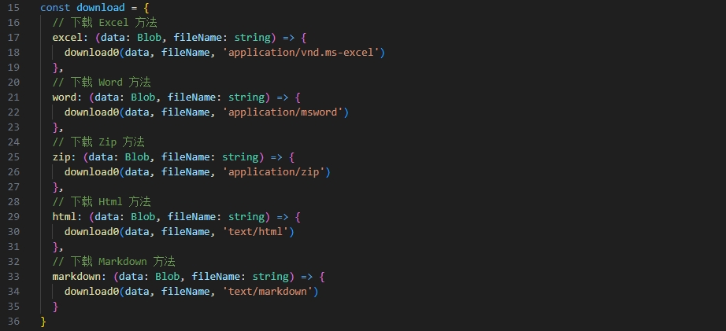
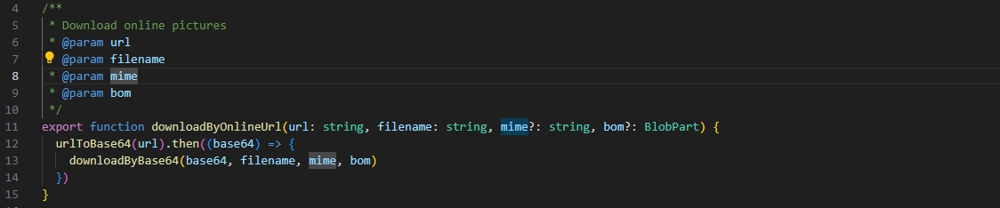
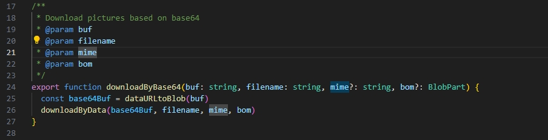
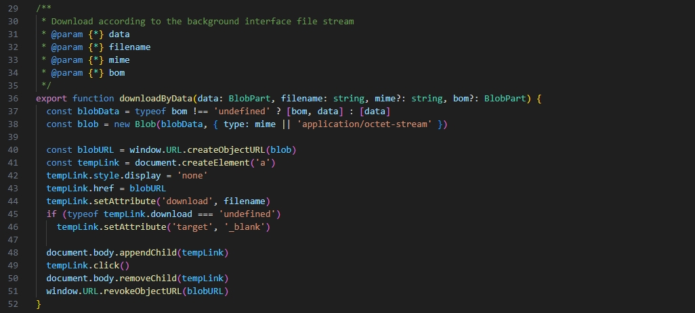

# download 对象

yudao-ui-admin-vben 里很多方法没有，文档内容与项目不一致，在 yudao-ui-admin-vue3 项目的 utils 文件夹下面找到了文档对应的 download.ts

## 说明

支持 Excel、Word、Zip、HTML 等类型的文件下载

## 示例

```js
// 以 blob 文件流的方式下载文件
// 核心代码
const download0 = (data: Blob, fileName: string, mineType: string) => {
  // 创建 blob
  const blob = new Blob([data], { type: mineType });
  // 创建 href 超链接，点击进行下载
  window.URL = window.URL || window.webkitURL;
  const href = URL.createObjectURL(blob);
  // 创建a链接
  const downA = document.createElement("a");
  // 设置链接属性
  downA.href = href;
  // 设置下载文件名称
  downA.download = fileName;
  // 模拟点击事件
  downA.click();
  // 销毁超连接
  window.URL.revokeObjectURL(href);
};

// 导出下载方法

```

## 其他下载方法

### 在线图片下载

原理：通过将下线图片URL转换成base64格式，底层仍然通过blob实现文件下载








### 通过URL下载

原理：模拟浏览器a链接点击，下载文件
缺点：跨域请求时，无法自定义下载文件名称